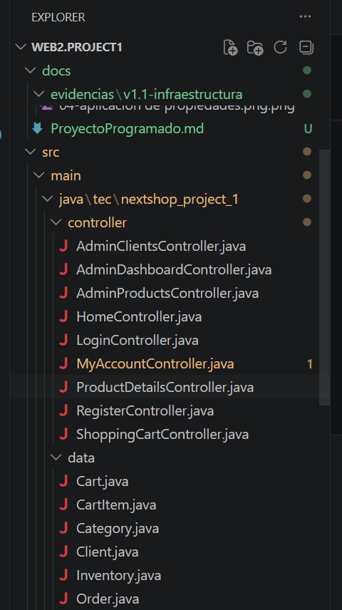
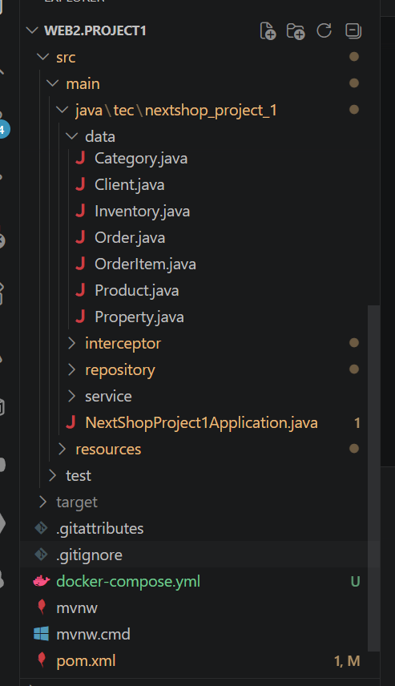
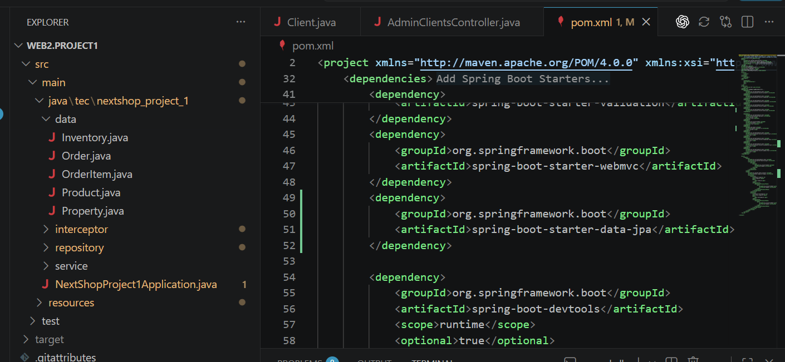

# Proyecto Programado

## 1. Portada

**Nombre del proyecto:** NextShop  
**Curso:** Programacion Web 2  
**Integrantes:** Edgardo Mora, Oscar Marin  
**Fecha:** Junio 2026

## 2. Descripcion General

NextShop es una aplicacion web desarrollada con Spring Boot y Thymeleaf que simula una tienda en linea. El objetivo del sistema es permitir que los clientes puedan consultar productos, buscar articulos por categoria o nombre, revisar el detalle de un producto y agregar productos a un carrito de compras.

El sistema tambien incluye un modulo administrativo para la gestion de productos y clientes. Desde este modulo, un usuario con perfil administrador puede consultar registros, realizar busquedas, editar informacion y activar o desactivar elementos del sistema.

En esta version, el proyecto trabaja con datos almacenados en memoria. Esta decision permite validar las funcionalidades principales y mantener una arquitectura preparada para incorporar persistencia con Spring Data JPA y base de datos.

## 3. Actores del Sistema

### Cliente

El cliente representa al usuario comprador de la tienda. Puede registrarse, iniciar sesion, navegar por el catalogo de productos, consultar detalles, agregar productos al carrito y acceder a la pantalla de mi cuenta.

### Administrador

El administrador es el usuario encargado de gestionar la informacion principal del sistema. Puede ingresar al modulo administrativo, revisar productos y clientes, buscar registros, crear nuevos administradores, editar informacion y activar o desactivar productos o usuarios.

## 4. Funcionalidades Implementadas

### Funcionalidades publicas

- Visualizacion de la pagina principal con productos destacados, productos en oferta y productos recientes.
- Busqueda de productos por categoria y nombre.
- Visualizacion del detalle de un producto.
- Registro de nuevos clientes.
- Inicio de sesion mediante correo electronico y contrasena.
- Cierre de sesion.
- Acceso a la pantalla de mi cuenta para usuarios autenticados.

### Funcionalidades de carrito

- Acceso al carrito solo para usuarios autenticados.
- Agregar productos al carrito desde la vista de detalle del producto.
- Visualizacion de productos agregados al carrito.
- Validacion basica de existencia del producto y disponibilidad de stock antes de agregarlo.

El carrito se encuentra planteado como un modulo que puede crecer de forma gradual. La version actual se enfoca en el acceso del usuario autenticado, la adicion de productos y la visualizacion del contenido agregado.

### Funcionalidades administrativas

- Acceso al dashboard administrativo solo para usuarios con perfil administrador.
- Listado de productos registrados.
- Busqueda de productos por diferentes criterios.
- Creacion de productos.
- Edicion de productos.
- Activacion y desactivacion de productos.
- Listado de clientes registrados.
- Busqueda de clientes.
- Creacion de usuarios administradores.
- Edicion de informacion editable de clientes.
- Activacion y desactivacion de clientes, evitando que el administrador se desactive a si mismo.

## 5. Reglas de Negocio

Las reglas de negocio consideradas en la version actual son las siguientes:

- Un cliente no puede registrarse con un correo electronico que ya exista.
- El inicio de sesion valida que el correo exista, que la contrasena coincida y que la cuenta este activa.
- Los usuarios inactivos no pueden iniciar sesion correctamente.
- Existen dos perfiles de usuario: cliente y administrador.
- El modulo administrativo solo debe ser utilizado por usuarios con perfil administrador.
- Un administrador no puede desactivar su propia cuenta desde la administracion de clientes.
- Un producto no puede crearse si ya existe otro producto con el mismo SKU.
- Los productos pueden marcarse como destacados.
- Los productos pueden tener porcentaje de descuento.
- Los productos pueden estar activos o inactivos.
- Antes de agregar un producto al carrito se valida que el producto exista y que tenga stock disponible.
- El carrito se asocia al cliente que se encuentra autenticado en la sesion.

## 6. Arquitectura General

El proyecto esta organizado usando una estructura por capas. Esta organizacion permite separar las responsabilidades del sistema y facilita la incorporacion de nuevos componentes conforme avance el proyecto.

### Controller

La capa de controladores recibe las solicitudes HTTP y decide que vista mostrar o que accion ejecutar. En el proyecto existen controladores para las paginas publicas, login, registro, carrito, cuenta de usuario y modulo administrativo.

Ejemplos:

- `HomeController`
- `LoginController`
- `RegisterController`
- `ShoppingCartController`
- `AdminProductsController`
- `AdminClientsController`

### Service

La capa de servicios contiene la logica principal del sistema. Aqui se validan reglas como correos duplicados, SKU duplicados, autenticacion de usuarios, busqueda de productos y manejo basico del carrito.

Ejemplos:

- `ClientService`
- `ProductService`
- `CategoryService`
- `InventoryService`
- `ShoppingCartService`

### Repository

La capa de repositorios se encarga del acceso a los datos. En esta version, los datos se almacenan en memoria por medio de listas y mapas. Tambien existen interfaces que facilitan la integracion posterior con Spring Data JPA.

Ejemplos:

- `ClientRepository`
- `ProductRepository`
- `CategoryRepository`
- `InventoryRepository`
- `ShoppingCartRepository`

### Model

La capa de modelos contiene las clases que representan los datos principales del sistema.

Modelos principales:

- `Client`
- `Product`
- `Category`
- `Inventory`
- `Cart`
- `CartItem`
- `Order`
- `OrderItem`
- `Property`

### Thymeleaf

Las vistas del sistema estan desarrolladas con Thymeleaf. Se utilizan plantillas para las paginas principales y fragmentos reutilizables para elementos comunes como encabezados, pie de pagina, panel lateral y mensajes de error.

## 7. Supuestos

- El sistema se ejecuta en un ambiente local de desarrollo.
- Los datos cargados al iniciar la aplicacion son datos de prueba.
- La informacion cargada durante la ejecucion corresponde a datos de prueba almacenados en memoria.
- Los usuarios administradores ya existen en los datos iniciales o pueden ser creados desde el modulo administrativo.
- El control de acceso se realiza de forma manual mediante la sesion del usuario.
- La aplicacion representa una base funcional para el proyecto academico y esta disenada para crecer de manera modular.

## 8. Limitaciones Conocidas

El proyecto se encuentra en desarrollo continuo. Por esta razon, algunas decisiones tecnicas se mantienen en una version inicial y pueden fortalecerse en las siguientes etapas.

- La persistencia de datos se maneja en memoria, lo cual facilita la prueba del flujo principal antes de integrar una base de datos.
- El control de acceso se realiza mediante sesion y validaciones en los controladores.
- Las validaciones de formularios se realizan principalmente de forma manual desde los servicios y controladores.
- La arquitectura permite incorporar servicios REST y operaciones adicionales conforme avance el proyecto.
- Los modulos de carrito, pedidos, categorias e inventario estan preparados para ampliarse en etapas posteriores.
- Las pruebas automatizadas se mantienen en un nivel basico para verificar la carga del contexto de Spring.

## 9. Evidencias

En esta seccion se reservaran los espacios para las capturas de pantalla del sistema.

### Login

Espacio reservado para captura.

### Registro

Espacio reservado para captura.

### Home y Catalogo

Espacio reservado para captura.

### Busqueda de Productos

Espacio reservado para captura.

### Detalle de Producto

Espacio reservado para captura.

### Carrito de Compras

Espacio reservado para captura.

### Mi Cuenta

Espacio reservado para captura.

### Dashboard Administrativo

Espacio reservado para captura.

### Administracion de Productos

Espacio reservado para captura.

### Edicion o Creacion de Productos

Espacio reservado para captura.

### Administracion de Clientes

Espacio reservado para captura.

### Edicion o Creacion de Clientes

Espacio reservado para captura.

## 10. Conclusion

NextShop cuenta con una base funcional para una tienda en linea desarrollada con Spring Boot, Thymeleaf y una arquitectura por capas. El proyecto permite demostrar navegacion, catalogo, registro, login, carrito basico y administracion de productos y clientes.

La estructura actual permite continuar el desarrollo de manera ordenada, incorporando nuevos componentes como persistencia con base de datos, seguridad y servicios adicionales segun los requerimientos del Proyecto Programado.

## Evidencias

### Versión 1.1 – Infraestructura de Persistencia

| Figura   | Descripción                                          | Archivo                                                           |
| -------- | ---------------------------------------------------- | ----------------------------------------------------------------- |
| Figura 1 | Estructura general del proyecto                      | `evidencias/v1.1-infraestructura/01-estructura-proyecto-raiz.png` |
| Figura 2 | Organización de paquetes del proyecto                | `evidencias/v1.1-infraestructura/02-estructura-paquetes.png`      |
| Figura 3 | Dependencias Spring Data JPA y MySQL                 | `evidencias/v1.1-infraestructura/03-dependencias-jpa.png`         |
| Figura 4 | Contenedor Docker de NextShop                        | `evidencias/v1.1-infraestructura/04-docker-nextshop.png`          |
| Figura 5 | Configuración de conexión (`application.properties`) | `evidencias/v1.1-infraestructura/05-application-properties.png`   |
| Figura 6 | Inicio exitoso de Spring Boot                        | `evidencias/v1.1-infraestructura/06-spring-boot-running.png`      |
| Figura 7 | Aplicación NextShop ejecutándose                     | `evidencias/v1.1-infraestructura/07-nextshop-home.png`            |

#### Figura 1. Estructura general del proyecto

#### Figura 2. Organización de paquetes del proyecto

#### Figura 3. Dependencias Spring Data JPA y MySQL

#### Figura 4. Contenedor Docker de NextShop

#### Figura 5. Configuración de conexión (`application.properties`)

#### Figura 6. Inicio exitoso de Spring Boot

#### Figura 7. Aplicación NextShop ejecutándose

