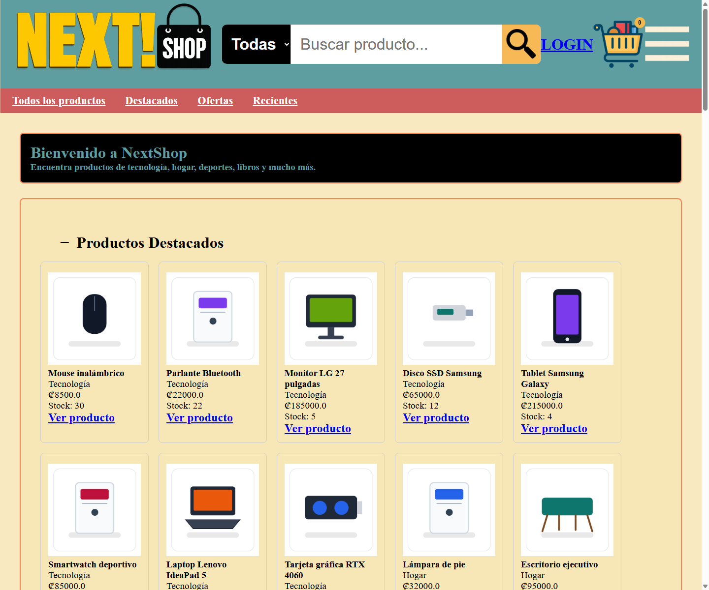
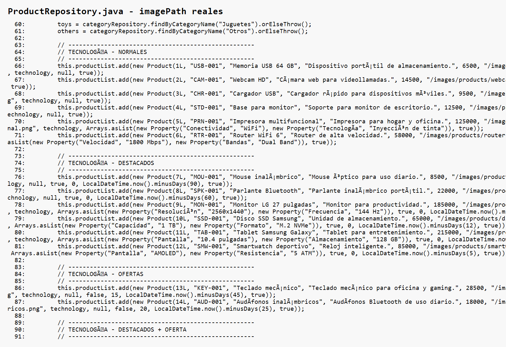
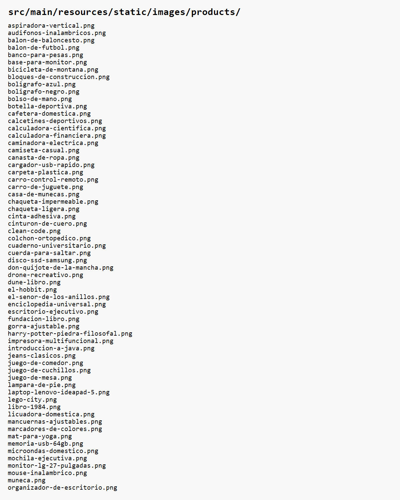
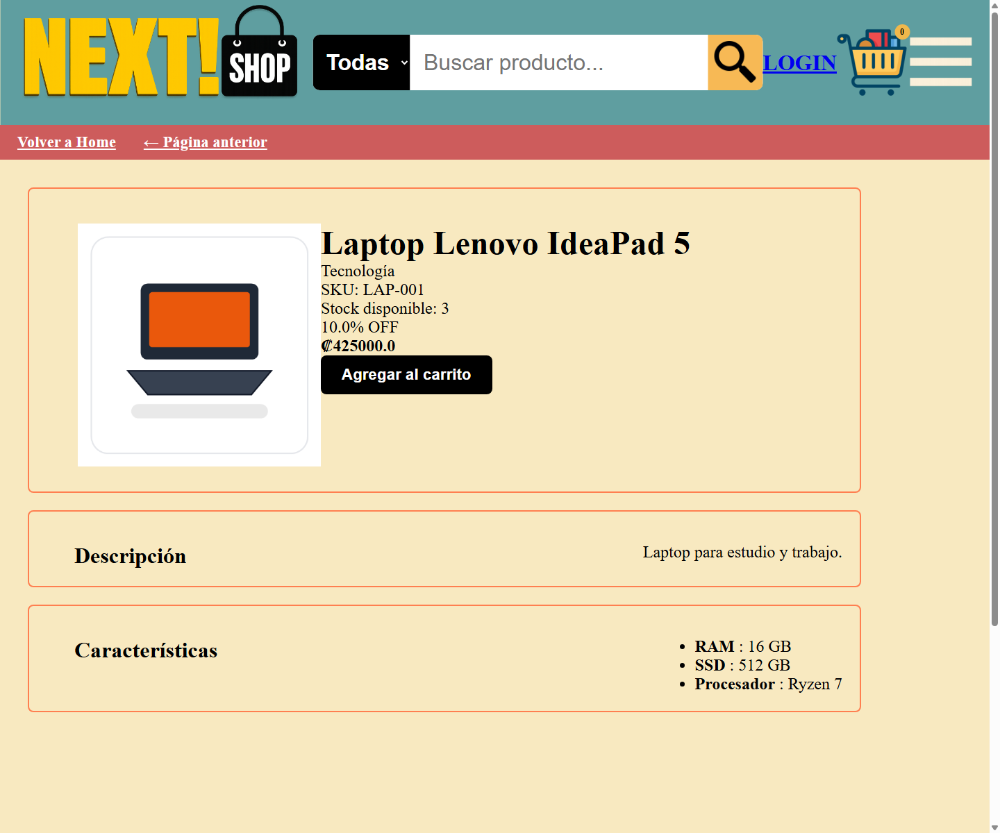
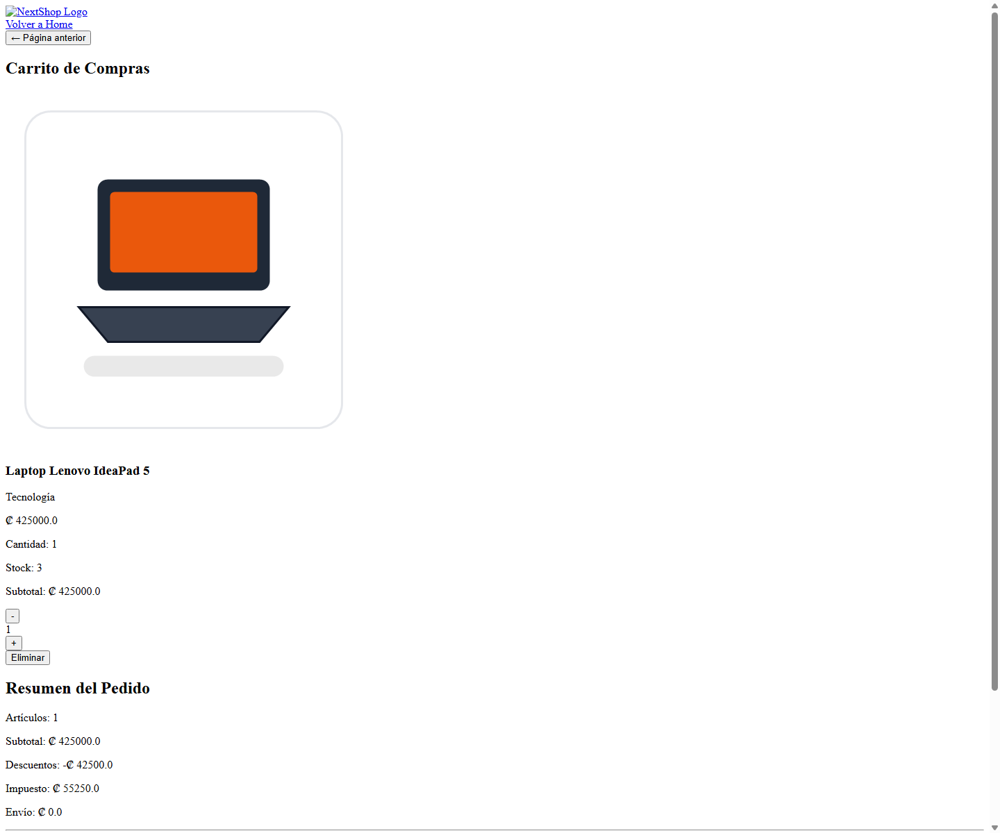
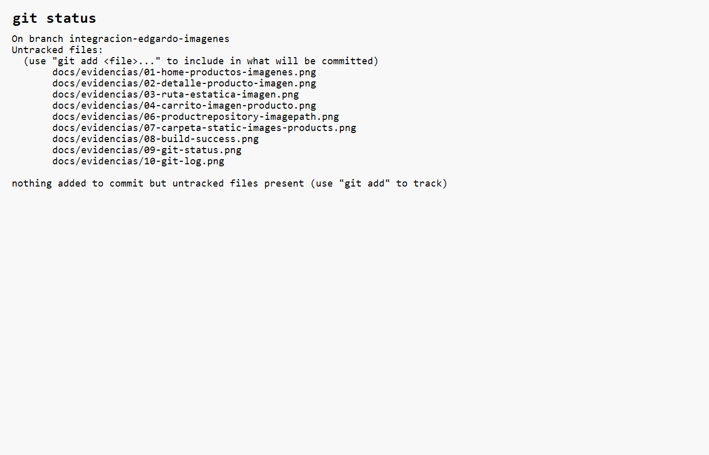
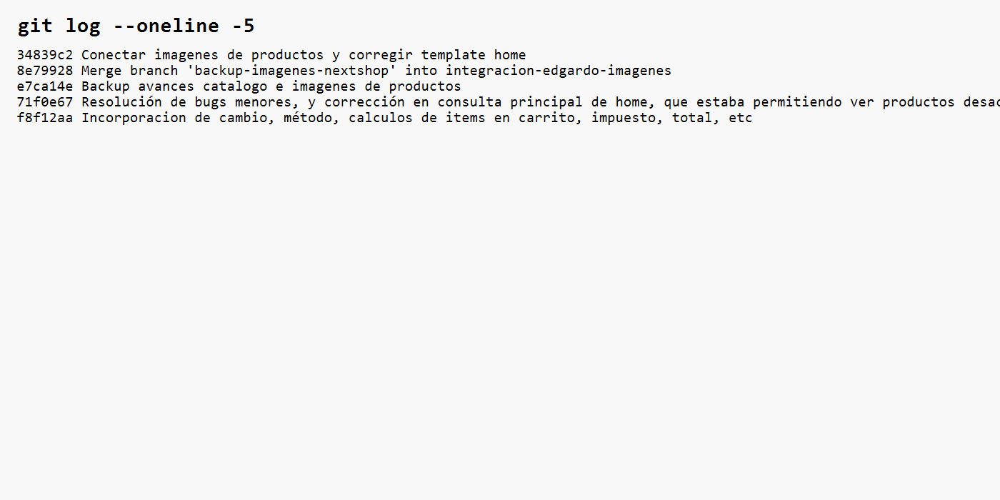

# Proyecto Programado: NextShop

**Universidad:** Instituto Tecnológico de Costa Rica  
**Carrera:** Ingeniería del Software  
**Nombre del curso:** Programación Web II  
**Profesor:** Carlos Arias Rodriguez  
**Nombre del Proyecto Programado:** NextShop  
**Integrantes:** Edgardo Mora, Oscar Marín  
**Fecha:** Junio de 2026  

---

## Índice

1. Resumen ejecutivo
2. Introducción
3. Planteamiento del problema
4. Objetivos del proyecto
5. Alcance funcional
6. Marco conceptual aplicado
7. Arquitectura general de NextShop
8. Modelo de datos y persistencia
9. Gestión de productos y catálogo visual
10. Módulo de imágenes de productos
11. Interfaz de usuario con Thymeleaf
12. Gestión de sesiones, login y perfiles
13. Carrito de compras
14. Módulo administrativo
15. Validaciones y reglas de negocio
16. Pruebas y evidencias
17. Control de versiones y trabajo colaborativo
18. Conclusiones
19. Anexos

**ANEXOS**

- Anexo A - Control del documento
- Anexo B - Ficha técnica del proyecto
- Anexo C - Documentos de apoyo
- Anexo D - Evidencias visuales
- Anexo E - Datos del módulo de imágenes

---

## 1. Resumen ejecutivo

NextShop es una aplicación web desarrollada con Spring Boot y Thymeleaf para gestionar una tienda en línea. El sistema permite consultar productos, ver detalles, iniciar sesión, agregar productos al carrito y administrar información del catálogo desde módulos internos.

La versión documentada trabaja con persistencia relacional en MySQL mediante Spring Data JPA. Esta implementación conserva la separación entre controladores, servicios, repositorios y vistas, y permite que productos, categorías, usuarios e inventario se administren desde base de datos.

Uno de los avances principales del proyecto fue la integración del catálogo visual de productos. Se auditaron 99 registros, se definieron 87 rutas PNG únicas y se conectó cada producto con su imagen mediante `imagePath`.

Esta implementación corresponde al uso del patrón MVC, recursos estáticos y separación por capas estudiados durante el curso.

**Evidencia principal**



La captura muestra la página principal renderizando productos reales del repositorio con imágenes cargadas desde `imagePath`. Evidencia la integración entre repositorio, servicio, controlador, vista Thymeleaf y recursos estáticos.

---

## 2. Introducción

NextShop fue desarrollado como una solución web para la gestión de una tienda en línea. La aplicación integra navegación pública, autenticación de usuarios, carrito de compras y módulos administrativos.

La implementación se organizó en capas para mantener responsabilidades claras. Los controladores atienden solicitudes HTTP, los servicios aplican reglas de negocio, los repositorios administran los datos de la aplicación y las vistas Thymeleaf presentan la información al usuario.

El proyecto también incorpora un módulo visual de productos. Las imágenes se almacenan como archivos PNG dentro de `static/images/products/` y se referencian desde cada producto mediante una ruta pública.

**Evidencias relacionadas**

- `docs/evidencias/01-home-productos-imagenes.png`: muestra la página principal con productos e imágenes.
- `docs/evidencias/02-detalle-producto-imagen.png`: muestra un producto individual con su imagen asociada.

---

## 3. Planteamiento del problema

Una tienda en línea necesita organizar productos, categorías, usuarios, inventario, carrito y recursos visuales de manera coherente. Si estas responsabilidades se mezclan, el sistema se vuelve difícil de mantener y de extender.

NextShop resuelve este problema mediante una estructura MVC por capas. La información de productos se administra desde repositorios JPA conectados a MySQL, la lógica se concentra en servicios y las vistas consumen los datos preparados por los controladores.

Durante la integración del catálogo visual se reemplazaron imágenes genéricas por imágenes específicas de producto sin modificar la base funcional del sistema. Para ello se documentó el catálogo, se prepararon imágenes PNG y se conectaron mediante `imagePath`.

Esta solución aplica separación de responsabilidades, renderizado dinámico y uso de recursos estáticos.

---

## 4. Objetivos del proyecto

### Objetivo general

Desarrollar una aplicación web de comercio electrónico llamada NextShop que permita gestionar y visualizar productos, usuarios, carrito de compras y recursos estáticos aplicando los conceptos de Programación Web II.

### Objetivos específicos

- Implementar una arquitectura MVC organizada por capas.
- Construir vistas dinámicas con Thymeleaf.
- Administrar datos mediante repositorios JPA conectados a MySQL.
- Permitir consulta, búsqueda y detalle de productos.
- Gestionar sesiones de usuario para clientes y administradores.
- Integrar imágenes de productos mediante rutas `imagePath`.
- Validar el funcionamiento con compilación, rutas HTTP y evidencias visuales.

**Evidencias relacionadas**

- `docs/evidencias/08-build-success.png`: confirma compilación exitosa.
- `docs/evidencias/09-git-status.png`: confirma el estado del repositorio al momento de generar evidencias.

---

## 5. Alcance funcional

La versión actual de NextShop incluye funcionalidades públicas, autenticadas y administrativas.

**Funcionalidades públicas**

- Visualización de productos en la página principal.
- Búsqueda de productos por categoría y nombre.
- Visualización del detalle de un producto.
- Registro e inicio de sesión.

**Funcionalidades autenticadas**

- Acceso al carrito de compras.
- Agregado de productos al carrito.
- Visualización de productos agregados.
- Consulta de cuenta de usuario.

**Funcionalidades administrativas**

- Acceso al panel administrativo.
- Listado y búsqueda de productos.
- Creación y edición de productos.
- Activación y desactivación de productos.
- Gestión básica de clientes.

Esta sección delimita el alcance entregado y resume las funcionalidades implementadas en la versión final del Proyecto Programado.

---

## 6. Marco conceptual aplicado

NextShop aplica los conceptos del curso desde una implementación concreta, no como un resumen teórico.

**Arquitectura MVC**

Los controladores reciben solicitudes HTTP, los servicios procesan reglas de negocio, los repositorios entregan datos y Thymeleaf renderiza las vistas.

**Spring Boot**

El proyecto utiliza Spring Boot para ejecutar la aplicación, registrar componentes y servir recursos web.

**Thymeleaf**

Las vistas usan expresiones como `th:src`, `th:text` y `th:href` para mostrar datos enviados por los controladores.

**Persistencia con Spring Data JPA**

Los datos principales se administran mediante repositorios JPA conectados a MySQL. Las interfaces de repositorio mantienen desacoplados los servicios de la implementación concreta de acceso a datos.

**Recursos estáticos**

Las imágenes de productos se sirven desde `src/main/resources/static/images/products/` mediante rutas públicas como `/images/products/laptop-lenovo-ideapad-5.png`.

Esta implementación corresponde al uso del patrón MVC, plantillas del lado servidor y recursos estáticos vistos durante el curso.

---

## 7. Arquitectura general de NextShop

La arquitectura del proyecto está organizada por capas:

| Capa | Responsabilidad | Ejemplos |
| --- | --- | --- |
| Controller | Atiende solicitudes HTTP y selecciona vistas o redirecciones | `HomeController`, `ProductDetailsController`, `ShoppingCartController`, `AdminProductsController` |
| Service | Aplica reglas de negocio y validaciones | `ProductService`, `ClientService`, `ShoppingCartService`, `InventoryService` |
| Repository | Accede a datos mediante interfaces y adaptadores JPA | `JpaProductRepositoryAdapter`, `JpaClientRepositoryAdapter`, `JpaCategoryRepositoryAdapter`, `JpaInventoryRepositoryAdapter` |
| Data / Model | Representa entidades del dominio | `Product`, `Client`, `Category`, `Inventory`, `Cart` |
| Templates | Renderiza HTML con Thymeleaf | `home.html`, `ProductDetails.html`, `ShoppingCart.html` |
| Static | Expone CSS, imágenes y recursos públicos | `images/products/`, `css/` |

Esta organización permite ubicar cada cambio en una capa específica. Los servicios trabajan contra interfaces de repositorio y no dependen directamente de la tecnología de almacenamiento. La implementación principal utiliza adaptadores JPA para acceder a MySQL, mientras que los repositorios en memoria quedan disponibles únicamente bajo el perfil `in-memory`.

El beneficio principal de esta arquitectura es la separación entre lógica de negocio y acceso a datos. Por ejemplo, la conexión de imágenes se mantuvo en el dato `imagePath` del producto y las vistas ya consumían `product.imagePath`, por lo que no fue necesario rediseñar la interfaz.

**Evidencias relacionadas**

- `docs/evidencias/06-productrepository-imagepath.png`: muestra productos con rutas reales.
- `docs/evidencias/07-carpeta-static-images-products.png`: muestra la carpeta de imágenes estáticas.

---

## 8. Modelo de datos y persistencia

NextShop utiliza MySQL como base de datos relacional para manejar productos, categorías, clientes, inventario, órdenes y detalles de órdenes. Se eligió MySQL por ser un motor relacional estable, ampliamente utilizado y adecuado para representar relaciones entre productos, categorías, usuarios, inventario y pedidos.

La integración se realiza con Spring Data JPA porque permite trabajar con entidades Java y repositorios declarativos, reduciendo código repetitivo de acceso a datos y manteniendo una capa de persistencia coherente con Spring Boot. El proyecto conserva una estructura por interfaces para separar los servicios de la tecnología de persistencia. Los repositorios en memoria permanecen como alternativa de perfil, mientras que la ejecución principal utiliza los adaptadores JPA y la base `nextshopdb`.

En el caso de productos, cada registro incluye información como identificador, SKU, nombre, descripción, precio, categoría, propiedades, estado, stock y ruta de imagen. El campo `imagePath` queda persistido como metadato del producto y apunta a archivos estáticos PNG.

Hibernate administra la creación y actualización de tablas mediante la configuración `spring.jpa.hibernate.ddl-auto=update`. Además, `DataInitializer` carga la información inicial cuando la base está vacía: categorías, clientes, productos e inventario. Este proceso permite levantar una base local funcional sin copiar manualmente archivos SQL ni respaldos de base de datos.

El carrito de compras se mantiene en sesión/memoria por decisión de diseño, ya que representa un estado temporal asociado al usuario autenticado durante su navegación.

Esta implementación corresponde al uso de repositorios, entidades, ORM y persistencia relacional vistos durante el curso.

### 8.1 Base de datos local con Docker Compose

El proyecto incluye `docker-compose.yml` para levantar una base MySQL local reproducible. El servicio utiliza una imagen compatible de MySQL, expone el puerto local `3307` hacia el puerto interno `3306` y crea la base `nextshopdb` al iniciar el contenedor por primera vez.

El archivo no depende de rutas absolutas del equipo de un desarrollador. Utiliza un volumen nombrado de Docker para conservar los datos locales sin versionar la base física en Git. Su propósito es que cada integrante pueda levantar su propio ambiente local con la misma configuración general de base de datos.

---

## 9. Gestión de productos y catálogo visual

El catálogo visual se construyó mediante una auditoría documental del inventario existente. El objetivo fue identificar los productos reales usados por el sistema y definir una imagen específica para cada producto único.

Documentos de apoyo:

- `docs/inventario-productos-imagenes.md`
- `docs/catalogo-visual-productos.md`
- `docs/fuente-imagenes-productos.md`
- `docs/catalogo-imagenes-productos.md`

Resultados del catálogo:

| Indicador | Resultado |
| --- | --- |
| Registros auditados | 99 |
| Rutas PNG únicas | 87 |
| Duplicados controlados | 12 |
| Imágenes faltantes | 0 |
| Fallback conservado | `productIcon.png` |

Los productos duplicados conservan la misma imagen cuando representan el mismo artículo. Esto evita inconsistencias visuales y mantiene trazabilidad con los registros originales.

**Evidencias relacionadas**

- `docs/evidencias/01-home-productos-imagenes.png`: muestra productos renderizados con imágenes.
- `docs/evidencias/07-carpeta-static-images-products.png`: muestra los PNG disponibles.

---

## 10. Módulo de imágenes de productos

El módulo de imágenes conecta cada producto con una ruta pública mediante el atributo `imagePath`. Las imágenes se encuentran en:

```text
src/main/resources/static/images/products/
```

La ruta pública utilizada por la aplicación sigue este formato:

```text
/images/products/nombre-del-producto.png
```

La integración se realizó conectando cada producto con su ruta `imagePath` y conservando esos valores en la persistencia de productos. No se modificaron nombres, categorías, precios, descripciones ni lógica de negocio. El fallback `productIcon.png` se conserva como imagen predeterminada del sistema, pero los productos existentes ya usan rutas específicas.

Esta implementación evidencia el uso de recursos estáticos en Spring Boot y renderizado dinámico con Thymeleaf.

**Evidencias**


La captura muestra una imagen servida directamente desde `/images/products/`. Confirma que Spring Boot expone correctamente los archivos ubicados en `static/images/products/`.



La captura muestra productos con rutas como `/images/products/laptop-lenovo-ideapad-5.png`. Evidencia que el repositorio conecta datos del producto con recursos estáticos.



La captura muestra los archivos PNG disponibles, incluyendo `productIcon.png`. Evidencia que las rutas definidas apuntan a archivos físicos existentes.

---

## 11. Interfaz de usuario con Thymeleaf

Las vistas de NextShop se renderizan con Thymeleaf. Los controladores cargan datos en el `Model` y las plantillas los muestran mediante expresiones dinámicas.

En el catálogo y detalle de productos, las imágenes se muestran usando `product.imagePath`. Esto permite que la vista no conozca el nombre físico de cada archivo; solo consume la ruta definida en el producto.

Vistas relacionadas:

- `src/main/resources/templates/pages/home.html`
- `src/main/resources/templates/pages/ProductDetails.html`
- `src/main/resources/templates/pages/ShoppingCart.html`
- `src/main/resources/templates/fragments/ProductData.html`
- `src/main/resources/templates/managment/AdminProducts.html`

Esta implementación corresponde al renderizado de vistas del lado servidor visto en el curso.

**Evidencias**


La captura muestra tarjetas de producto con nombre, categoría, precio, stock e imagen. Evidencia el uso de Thymeleaf para presentar datos del backend.



La captura muestra el detalle de un producto individual con su imagen asociada. Evidencia la relación entre ruta dinámica y vista de detalle.

---

## 12. Gestión de sesiones, login y perfiles

NextShop maneja usuarios mediante sesión HTTP. El sistema diferencia entre clientes y administradores, y utiliza esa información para permitir o restringir funcionalidades.

El login valida correo, contraseña y estado activo del usuario. Una vez autenticado, el cliente queda disponible en sesión para operaciones como acceder al carrito o agregar productos.

Esta implementación corresponde al manejo de estado con `HttpSession`, un concepto fundamental en aplicaciones web tradicionales.

**Evidencia relacionada**

- `docs/evidencias/04-carrito-imagen-producto.png`: muestra un producto agregado al carrito en una sesión de cliente.

---

## 13. Carrito de compras

El carrito de compras está asociado al cliente autenticado. Para agregar un producto, el sistema valida que el usuario tenga sesión activa, que el producto exista y que cuente con stock disponible.

La funcionalidad se implementa principalmente con:

- `ShoppingCartController`
- `ShoppingCartService`
- `ShoppingCartRepository`
- `InventoryService`
- `ProductService`

El carrito muestra producto, cantidad, stock, subtotal y resumen del pedido. También utiliza `item.product.imagePath` para presentar la imagen del producto agregado.

Esta implementación corresponde al uso de formularios, solicitudes POST, redirecciones y sesión HTTP.

**Evidencia**



La captura muestra un producto agregado al carrito con su imagen. Evidencia la relación entre sesión de cliente, carrito e imagen del producto.

---

## 14. Módulo administrativo

El módulo administrativo permite consultar y mantener información del sistema. Incluye rutas como:

- `/AdminProducts`
- `/AdminClients`
- `/AdminCategories`
- `/AdminDashboard`

Desde estas pantallas se gestionan productos, clientes y categorías según las opciones implementadas. Las operaciones incluyen búsqueda, edición, activación y desactivación.

El acceso administrativo depende del perfil del usuario. Por esta razón, el informe documenta el módulo a partir de su implementación, sus rutas y las evidencias de control de versiones, sin alterar seguridad ni vistas para generar una captura artificial.

Esta implementación corresponde al control de acceso básico por perfil y al mantenimiento de registros desde formularios web.

**Evidencia relacionada**

- `docs/evidencias/README.md`: contiene el índice de evidencias visuales generadas para el informe.

---

## 15. Validaciones y reglas de negocio

NextShop aplica reglas de negocio desde controladores y servicios. Las principales son:

- No registrar clientes con correo duplicado.
- Validar correo, contraseña y estado del usuario al iniciar sesión.
- Diferenciar perfil cliente y perfil administrador.
- Evitar SKU duplicado al crear productos.
- Permitir activar o desactivar productos y usuarios.
- Validar existencia del producto antes de agregarlo al carrito.
- Validar stock disponible antes de agregar al carrito.
- Asociar el carrito al cliente autenticado.

Estas reglas reducen errores de uso y mantienen coherencia entre interfaz, datos y lógica.

Esta implementación corresponde a la validación del lado servidor estudiada en el curso.

---

## 16. Pruebas y evidencias

Las pruebas realizadas verifican que la aplicación compila, sirve recursos estáticos y renderiza productos con imágenes.

### 16.1 Pruebas funcionales

| Prueba | Resultado | Evidencia |
| --- | --- | --- |
| Home `/` | Correcto | `01-home-productos-imagenes.png` |
| Detalle `/products/15` | Correcto | `02-detalle-producto-imagen.png` |
| Imagen estática | HTTP 200 | `03-ruta-estatica-imagen.png` |
| Carrito con producto | Correcto | `04-carrito-imagen-producto.png` |
| Login contra MySQL | Correcto | Validado con usuarios persistidos |
| Docker Compose operativo | Correcto | MySQL disponible en puerto local `3307` |

### 16.2 Pruebas técnicas

| Verificación | Resultado |
| --- | --- |
| Productos con `imagePath` | 99 |
| Rutas únicas usadas | 87 |
| Duplicados con imagen compartida | 12 |
| Imágenes faltantes | 0 |
| Fallback conservado | `productIcon.png` |
| Productos persistidos en MySQL | 99 |
| Inventarios persistidos en MySQL | 99 |
| Clientes iniciales persistidos en MySQL | 3 |
| Catálogo visual mediante `imagePath` | Correcto |

### 16.3 Compilación

El proyecto fue compilado con Maven:

```bash
mvn clean compile
```

Resultado esperado y obtenido:

```text
BUILD SUCCESS
```

### 16.4 Evidencias visuales

| Evidencia | Archivo | Qué demuestra |
| --- | --- | --- |
| Home con productos | `docs/evidencias/01-home-productos-imagenes.png` | Renderizado del catálogo con imágenes |
| Detalle de producto | `docs/evidencias/02-detalle-producto-imagen.png` | Imagen asociada al producto seleccionado |
| Ruta estática | `docs/evidencias/03-ruta-estatica-imagen.png` | Spring Boot sirviendo PNG desde `static/` |
| Carrito | `docs/evidencias/04-carrito-imagen-producto.png` | Producto en carrito con imagen |
| ProductRepository | `docs/evidencias/06-productrepository-imagepath.png` | Rutas `imagePath` reales |
| Carpeta de imágenes | `docs/evidencias/07-carpeta-static-images-products.png` | Archivos PNG físicos disponibles |
| Build | `docs/evidencias/08-build-success.png` | Compilación exitosa |
| MySQL y Docker Compose | `docker-compose.yml` | Base local reproducible para persistencia |
| Git status | `docs/evidencias/09-git-status.png` | Estado del repositorio |
| Git log | `docs/evidencias/10-git-log.png` | Historial reciente de commits |

Esta sección evidencia validación funcional, técnica y de control de versiones.

---

## 17. Control de versiones y trabajo colaborativo

El proyecto utiliza Git para registrar cambios, mantener trazabilidad y facilitar el trabajo colaborativo entre integrantes. La rama documentada es:

```text
integracion-edgardo-imagenes
```

Commits relevantes:

```text
690c794 Agregar compose local para MySQL
45e2dd1 Agregar persistencia JPA con MySQL
34839c2 Conectar imagenes de productos y corregir template home
```

Git versiona el código fuente, las entidades JPA, los adaptadores de repositorio, `docker-compose.yml`, `DataInitializer`, la configuración de la aplicación, la documentación y las imágenes del catálogo. La base de datos física no se versiona; cada desarrollador obtiene una base local propia al levantar Docker y ejecutar la aplicación.

El flujo colaborativo se ejecuta de la siguiente forma:

```bash
git pull
docker compose up -d
./mvnw spring-boot:run
```

En Windows también puede ejecutarse:

```bash
mvnw.cmd spring-boot:run
```

Con este flujo, Docker levanta MySQL, Hibernate crea o actualiza las tablas y `DataInitializer` carga automáticamente categorías, clientes, productos e inventario. Las imágenes ya están versionadas en Git y el campo `imagePath` queda persistido en MySQL. Como resultado, cada integrante obtiene una copia funcional del proyecto sin copiar manualmente bases de datos ni archivos SQL.

El uso de Git respalda el trabajo colaborativo y permite auditar los cambios realizados.

**Evidencias**



La captura muestra el estado del repositorio durante la generación de evidencias. Es importante para respaldar la trazabilidad del trabajo documentado.



La captura muestra los commits recientes. Evidencia la trazabilidad del avance del módulo de imágenes y del fix de home.

---

## 18. Conclusiones

NextShop demuestra una aplicación web funcional construida con Spring Boot, Thymeleaf y una arquitectura MVC por capas. El proyecto integra navegación pública, detalle de productos, sesiones de usuario, carrito de compras y módulos administrativos.

La persistencia relacional con MySQL, Spring Data JPA e Hibernate permite almacenar categorías, productos, inventario, clientes, órdenes y detalles de órdenes. El uso de Docker Compose facilita una base local reproducible, mientras que `DataInitializer` carga los datos iniciales necesarios para ejecutar el sistema.

La integración del catálogo visual fortalece la experiencia de usuario y evidencia el uso correcto de recursos estáticos. Cada producto del inventario queda conectado a una imagen mediante `imagePath`, manteniendo una separación clara entre datos persistidos y archivos físicos versionados.

El trabajo colaborativo se respalda con Git, que versiona el código fuente, la documentación, Docker Compose, las entidades JPA, los adaptadores de repositorio, las imágenes del catálogo y la configuración necesaria para reproducir el entorno. Esta implementación consolida los conceptos prácticos de Programación Web II: controladores, servicios, repositorios, vistas dinámicas, sesiones, validaciones, persistencia y control de versiones.

### Resumen ejecutivo de funcionalidades

| Funcionalidad | Estado |
| --- | --- |
| Login | Implementado |
| Catálogo | Implementado |
| CRUD Productos | Implementado |
| Carrito | Implementado |
| Integración de imágenes | Implementado |
| Recursos estáticos | Implementado |
| Validaciones | Implementado |
| Build Maven | Correcto |

---

## 19. Anexos

### Anexo A: Control del documento

| Elemento | Valor |
| --- | --- |
| Archivo principal | `docs/informe-final.md` |
| Evidencias visuales | `docs/evidencias/` |
| Documentos de apoyo | `docs/ProyectoProgramado.md`, `docs/inventario-productos-imagenes.md`, `docs/catalogo-visual-productos.md`, `docs/fuente-imagenes-productos.md`, `docs/catalogo-imagenes-productos.md` |
| Estado | Versión final para entrega |

### Anexo B: Ficha técnica del proyecto

| Elemento | Valor |
| --- | --- |
| Proyecto | NextShop |
| Tipo de sistema | Tienda en línea |
| Framework | Spring Boot |
| Motor de plantillas | Thymeleaf |
| Arquitectura | MVC por capas |
| Lenguaje principal | Java |
| Persistencia actual | MySQL con Spring Data JPA |
| Persistencia | Repositorios JPA sobre interfaces de acceso a datos |
| Recursos estáticos | CSS e imágenes desde `src/main/resources/static/` |
| Control de versiones | Git |
| Build | Maven |
| Estado | Funcional |

### Anexo C: Documentos de apoyo

- `docs/ProyectoProgramado.md`
- `docs/inventario-productos-imagenes.md`
- `docs/catalogo-visual-productos.md`
- `docs/fuente-imagenes-productos.md`
- `docs/catalogo-imagenes-productos.md`

### Anexo D: Evidencias visuales

- `docs/evidencias/README.md`
- `docs/evidencias/01-home-productos-imagenes.png`
- `docs/evidencias/02-detalle-producto-imagen.png`
- `docs/evidencias/03-ruta-estatica-imagen.png`
- `docs/evidencias/04-carrito-imagen-producto.png`
- `docs/evidencias/06-productrepository-imagepath.png`
- `docs/evidencias/07-carpeta-static-images-products.png`
- `docs/evidencias/08-build-success.png`
- `docs/evidencias/09-git-status.png`
- `docs/evidencias/10-git-log.png`

### Anexo E: Datos del módulo de imágenes

| Indicador | Valor |
| --- | --- |
| Registros de producto auditados | 99 |
| Rutas PNG únicas | 87 |
| Duplicados controlados | 12 |
| Imágenes faltantes | 0 |
| Fallback conservado | `productIcon.png` |
